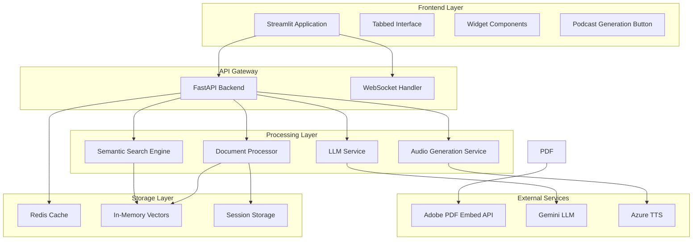
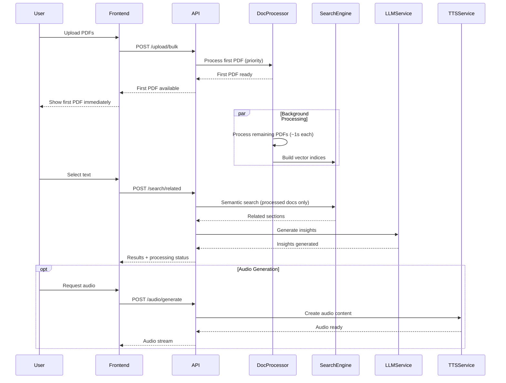
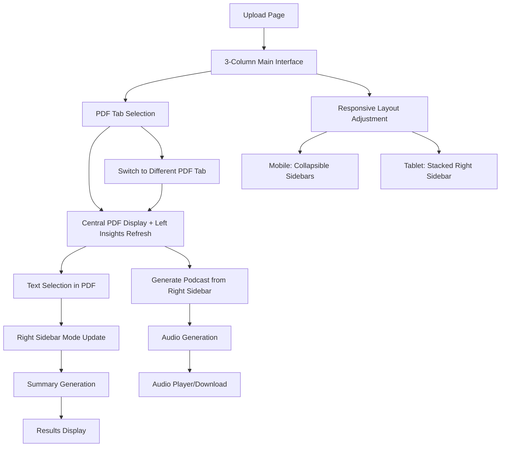
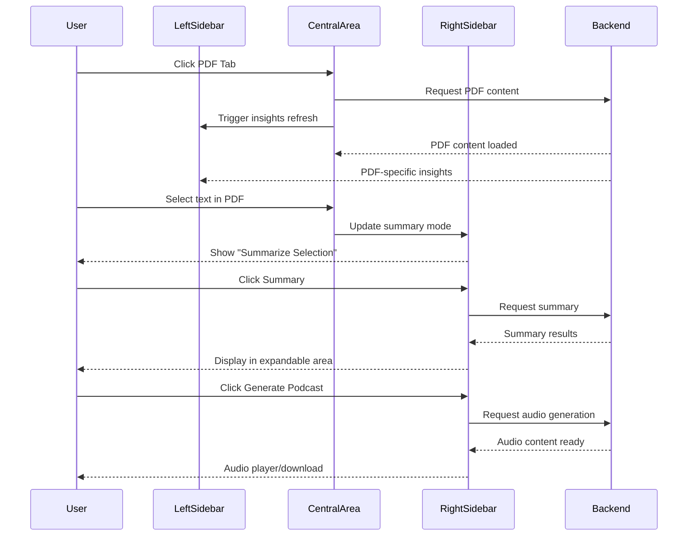

# Design Document

## Overview

The Multi-Document Analysis Workbench is architected as a Python-based web application with a Streamlit frontend and FastAPI backend, designed for session-based PDF analysis with progressive processing capabilities. The system employs a multi-tier architecture that prioritizes immediate user interaction while building comprehensive analysis capabilities in the background, featuring a tabbed interface with widget-based navigation.

### Key Design Principles

- **Progressive Processing**: Immediate user interaction with background document processing
- **Session-Based Architecture**: No persistent storage, all data exists only during user session
- **Performance-First**: Optimized for responsive user experience with reasonable accuracy targets
- **Graceful Degradation**: System continues to function even when components are unavailable
- **Scalable Processing**: Handles multiple large PDFs efficiently through background processing

## Architecture

### High-Level System Architecture



### Processing Flow Architecture



## Components and Interfaces

### Frontend Components

#### Main Interface Layout
- **Technology**: Streamlit with custom CSS for 3-column layout control
- **Structure**:
  ```
  ┌─────────────────────────────────────────────────────────────┐
  │                    Header Bar (Optional)                    │
  └─────────────────────────────────────────────────────────────┘
  ┌──────────────┬─────────────────────────────┬──────────────┐
  │ Left Sidebar │      Central Content        │ Right Sidebar│
  │   (20%)      │         (60%)               │    (20%)     │
  │              │                             │              │
  │ PDF Insights │ ┌─────────────────────────┐ │ [Podcast]    │
  │ - Takeaways  │ │ [Tab1][Tab2][Tab3]...   │ │              │
  │ - Examples   │ └─────────────────────────┘ │ [Summary]    │
  │ - Facts      │                             │              │
  │              │    PDF Viewing Area         │ Summary      │
  │ (Scrollable) │   - Text Selection          │ Results      │
  │              │   - Zoom Controls           │ (Expandable) │
  │              │   - Full PDF Display        │              │
  └──────────────┴─────────────────────────────┴──────────────┘
  ```

#### Left Sidebar - PDF Insights Component
- **Technology**: Streamlit sidebar with dynamic content loading
- **Responsibilities**:
  - Display insights for currently active PDF document
  - Automatic content updates when switching PDF tabs
  - Scrollable content management for long insights
  - Clear categorization of different insight types
- **Key Features**:
  - Dynamic content refresh based on active PDF tab
  - Clear section headers (Takeaways, Examples, Did You Know, etc.)
  - Scrollable interface for content overflow
  - Loading indicators during insight generation
  - Visual separation from central content area

#### Central Content Area - PDF Viewer Component
- **Technology**: Streamlit with PDF rendering integration (Adobe PDF Embed/PDF.js)
- **Responsibilities**:
  - Horizontal tab system for PDF navigation
  - Full PDF rendering with text selection capabilities
  - Zoom and scroll controls integration
  - Visual feedback for text selection states
- **Key Features**:
  - Tab system with PDF names/titles as labels
  - Active tab visual distinction (bold, highlighted background)
  - Instant PDF switching on tab click
  - Text selection capture with visual feedback
  - Integrated zoom and scroll controls
  - Clear visual boundaries separating from sidebars

#### Right Sidebar - Action Controls Component
- **Technology**: Streamlit sidebar with button components and expandable areas
- **Responsibilities**:
  - Compact podcast generation button at top
  - Summary functionality with mode detection
  - Results display in expandable area
  - Copy/export functionality for generated content
- **Key Features**:
  - Top-positioned "Generate Podcast" button (compact design)
  - Summary button with dual functionality indication
  - Mode detection: "Summarize Selection" vs "Summarize Document"
  - Expandable/scrollable summary results area
  - Copy and export options for summaries
  - Loading indicators during generation processes

#### Responsive Layout Component
- **Technology**: Streamlit responsive containers with CSS media queries
- **Responsibilities**:
  - Desktop: Maintain 60-20-20 ratio layout
  - Tablet: Stack right sidebar below central content
  - Mobile: Full-width central with collapsible sidebars
  - Visual hierarchy maintenance across screen sizes
- **Key Features**:
  - Breakpoint-based layout adjustments
  - Collapsible sidebar functionality on mobile
  - Maintained functionality across all screen sizes
  - Touch-friendly interface elements on mobile

### Backend Services

#### Document Processing Service
- **Technology**: Python with PyPDF2/pdfplumber for text extraction
- **Responsibilities**:
  - PDF text extraction and preprocessing
  - Section identification and chunking
  - Vector embedding generation using sentence-transformers
  - Background processing queue management
- **Processing Pipeline**:
  1. Priority processing for first/active PDF
  2. Text extraction with structure preservation
  3. Content chunking for optimal embedding
  4. Vector generation and indexing
  5. Progress tracking and status updates

#### Semantic Search Engine
- **Technology**: FAISS for vector similarity search
- **Responsibilities**:
  - Fast semantic search across processed documents
  - Multi-tier search strategy (fast → precision)
  - Relevance scoring and filtering
  - Cross-document relationship mapping
- **Search Strategy**:
  - Tier 1: Fast approximate search (FAISS IndexIVFFlat)
  - Tier 2: Precision search for low-confidence results
  - Confidence-based result filtering (>0.75 threshold)
  - Progressive search as documents are processed

#### LLM Integration Service
- **Technology**: Gemini 2.5 Flash via API
- **Responsibilities**:
  - Insight generation (takeaways, contradictions, examples)
  - Audio script creation for TTS
  - Content grounding validation
  - Response caching for performance
- **Insight Generation Pipeline**:
  1. Context aggregation (selected text + related sections)
  2. Structured prompt generation
  3. LLM inference with response validation
  4. Content grounding verification
  5. Result caching with semantic similarity

#### Audio Generation Service
- **Technology**: Azure Text-to-Speech API
- **Responsibilities**:
  - Audio script preparation from insights and content
  - Multi-speaker voice assignment
  - TTS processing and audio assembly
  - Streaming audio delivery
- **Audio Pipeline**:
  1. Content structuring for natural speech
  2. Speaker assignment (dual-speaker preferred)
  3. Parallel TTS processing
  4. Audio segment assembly
  5. Quality optimization and streaming

## Data Models

### Session Data Model
```python
class SessionData:
    session_id: str
    created_at: datetime
    expires_at: datetime
    documents: List[DocumentMetadata]
    processing_status: ProcessingStatus
    cache_keys: List[str]
```

### Document Model
```python
class Document:
    document_id: str
    filename: str
    content: str
    sections: List[DocumentSection]
    embeddings: np.ndarray
    processing_status: ProcessingStatus
    upload_timestamp: datetime
    
class DocumentSection:
    section_id: str
    title: str
    content: str
    page_number: int
    embedding: np.ndarray
    relevance_score: float
```

### Search Result Model
```python
class SearchResult:
    query: str
    results: List[SearchMatch]
    processing_status: ProcessingStatus
    confidence_score: float
    search_time_ms: int
    
class SearchMatch:
    document_id: str
    section_id: str
    snippet: str
    relevance_score: float
    page_number: int
    context: str
```

### Insights Model
```python
class InsightResponse:
    takeaways: List[str]
    contradictions: List[Contradiction]
    examples: List[Example]
    did_you_know: List[str]
    confidence_score: float
    generation_time_ms: int
    
class Contradiction:
    description: str
    source_documents: List[str]
    evidence: List[str]
    
class Example:
    description: str
    source_document: str
    context: str
```

## Error Handling

### Graceful Degradation Strategy

#### PDF Rendering Fallback
- Primary: Adobe PDF Embed API
- Fallback: PDF.js rendering
- Error Handling: Clear user notification with retry options

#### Search Performance Degradation
- Fast search unavailable → Use precision search only
- Partial document processing → Search available documents with status notification
- Low confidence results → Trigger precision mode automatically

#### LLM Service Failures
- Gemini API unavailable → Cache previous similar insights
- Rate limiting → Queue requests with user notification
- Low quality responses → Retry with refined prompts

#### Audio Generation Fallback
- Azure TTS unavailable → Provide text-only insights
- Generation timeout → Offer shorter audio alternatives
- Quality issues → Fallback to single-speaker mode

### Error Response Format
```python
class ErrorResponse:
    error_code: str
    message: str
    details: Optional[str]
    retry_available: bool
    fallback_options: List[str]
    user_action_required: bool
```

## Testing Strategy

### Unit Testing
- **Document Processing**: Text extraction accuracy, chunking logic
- **Search Engine**: Vector similarity calculations, relevance scoring
- **LLM Integration**: Prompt generation, response parsing, caching logic
- **Audio Generation**: Script formatting, TTS integration, audio assembly

### Integration Testing
- **End-to-End Workflows**: Upload → Process → Search → Insights → Audio
- **API Endpoints**: Request/response validation, error handling
- **External Service Integration**: Adobe PDF, Gemini LLM, Azure TTS
- **Performance Testing**: Response times under load, memory usage

### Performance Testing
- **Load Testing**: Multiple concurrent sessions, large PDF processing
- **Stress Testing**: Memory limits, processing queue capacity
- **Latency Testing**: Search response times, insight generation speed
- **Accuracy Testing**: Semantic relevance validation, insight quality

### User Experience Testing
- **Progressive Loading**: Background processing user experience
- **Error Scenarios**: Service failures, network issues, invalid uploads
- **Accessibility**: Screen reader compatibility, keyboard navigation
- **Cross-Browser**: Chrome, Firefox, Safari, Edge compatibility

## Deployment Architecture

### Docker Container Structure
```dockerfile
# Single Python-based container for both frontend and backend
FROM python:3.11-slim as base
# Install system dependencies for PDF processing and audio

FROM base as dependencies
# Install Python packages: streamlit, fastapi, sentence-transformers, etc.

FROM dependencies as production
# Copy application code and configure services
# Streamlit frontend + FastAPI backend in single container
# Target size: <20GB
```

### Application Startup Configuration
```yaml
# docker-compose.yml or startup script
services:
  pdf-workbench:
    build: .
    ports:
      - "8080:8080"
    environment:
      - STREAMLIT_SERVER_PORT=8080
      - FASTAPI_BACKEND_PORT=8000
    volumes:
      - ./credentials:/credentials
    command: |
      sh -c "
        uvicorn backend.main:app --host 0.0.0.0 --port 8000 &
        streamlit run frontend/main.py --server.port 8080 --server.address 0.0.0.0
      "
```

### Environment Configuration
```yaml
# Core Performance Settings
SPEED_PRIORITY: high
ACCURACY_MINIMUM: 0.85
PROCESSING_TIMEOUT_S: 60
BACKGROUND_PROCESSING_RATE: 1  # PDFs per second

# Service Integration
LLM_PROVIDER: gemini
GEMINI_MODEL: gemini-2.5-flash
TTS_PROVIDER: azure
ADOBE_PDF_EMBED_KEY: ${ADOBE_API_KEY}

# Storage Configuration
REDIS_URL: redis://localhost:6379
SESSION_TIMEOUT_HOURS: 4
CACHE_SIZE_MB: 2048

# Monitoring
METRICS_ENABLED: true
PERFORMANCE_LOGGING: detailed
ERROR_TRACKING: enabled
```

### Service Health Monitoring
- **Application Health**: API endpoint responsiveness
- **External Services**: Adobe PDF, Gemini, Azure TTS availability
- **Resource Monitoring**: Memory usage, CPU utilization, disk space
- **Performance Metrics**: Response times, accuracy scores, user engagement
- **Error Tracking**: Service failures, user errors, system exceptions

## User Interface Design Specifications

### Layout Structure and Visual Hierarchy

#### 3-Column Layout Design
```
┌──────────────────────────────────────────────────────────────────────────────┐
│                              Optional Header Bar                              │
└──────────────────────────────────────────────────────────────────────────────┘
┌─────────────────┬──────────────────────────────────────┬─────────────────┐
│  Left Sidebar   │           Central Content            │  Right Sidebar  │
│     (20%)       │              (60%)                   │      (20%)      │
├─────────────────┼──────────────────────────────────────┼─────────────────┤
│ PDF Insights    │ ┌──────────────────────────────────┐ │ [Generate       │
│                 │ │ [PDF1][PDF2][PDF3]...[PDFN]     │ │  Podcast]       │
│ • Takeaways     │ └──────────────────────────────────┘ │                 │
│ • Contradictions│                                      │ [Summary Button]│
│ • Examples      │        PDF Viewing Area              │                 │
│ • Did You Know  │     • Text Selection Enabled        │ ┌─────────────┐ │
│                 │     • Zoom/Pan Controls              │ │   Summary   │ │
│ (Auto-refresh   │     • Full Document Display          │ │   Results   │ │
│  per active     │                                      │ │             │ │
│  PDF tab)       │                                      │ │ (Expandable)│ │
│                 │                                      │ └─────────────┘ │
│ (Scrollable)    │                                      │                 │
└─────────────────┴──────────────────────────────────────┴─────────────────┘
```

#### Responsive Breakpoints
- **Desktop (>1200px)**: Full 3-column layout (20%-60%-20%)
- **Tablet (768px-1200px)**: Central content + left sidebar, right sidebar stacked below
- **Mobile (<768px)**: Full-width central content, collapsible sidebars

### Visual and UX Guidelines Implementation

#### PDF Tab Navigation Styling
- **Active Tab**: Bold text, highlighted background, distinct border
- **Inactive Tabs**: Standard text, muted background  
- **Tab Labels**: Display PDF names/titles for easy identification
- **Tab Switching**: Instant content update with smooth transitions
- **Responsive Behavior**: 
  - Desktop: Horizontal tab bar within central content area
  - Mobile: Horizontal scroll or dropdown selector

#### Left Sidebar Insights Styling
- **Section Headers**: Clear typography hierarchy for different insight categories
- **Content Organization**: Takeaways, Contradictions, Examples, Did You Know facts
- **Visual Separation**: Subtle background differentiation from central content
- **Scrollable Content**: Overflow handling for long insight lists
- **Loading States**: Skeleton loading or spinner during insight generation
- **Auto-refresh**: Content updates automatically when switching PDF tabs

#### Right Sidebar Action Design
- **Generate Podcast Button**:
  - Position: Top of right sidebar, compact design
  - Icon: Microphone or audio wave icon
  - States: Default, hover, loading, disabled
  - Functionality: Operates on currently visible PDF
- **Summary Button**:
  - Position: Below podcast button
  - Dynamic Labels: "Summarize Selection" vs "Summarize Document"
  - Visual Mode Indication: Clear indication of current summarization mode
- **Results Area**:
  - Expandable/collapsible summary display
  - Copy and export functionality
  - Clear typography for readability
  - Loading indicators during generation

### User Flow Design Patterns

#### Navigation Flow


#### Interactive Behavior Flow


#### Responsive Design Breakpoints
- **Desktop (>1200px)**: Full layout with all elements visible
- **Tablet (768px-1200px)**: Condensed tabs, adjusted widget grid
- **Mobile (<768px)**: Stacked layout, dropdown navigation, single-column widgets

### Accessibility and Usability Standards

#### Keyboard Navigation
- Tab order: Header → Tabs → Summary → Widgets → Content
- Keyboard shortcuts: Ctrl+1-9 for tab switching
- Focus indicators: Clear visual focus rings
- Screen reader: Proper ARIA labels and descriptions

#### Color and Contrast
- High contrast ratios (WCAG AA compliance)
- Color-blind friendly palette
- Clear visual hierarchy through typography and spacing
- Consistent color coding for different widget types

#### Interaction Feedback
- Loading states for all async operations
- Progress indicators for background processing
- Success/error notifications with clear messaging
- Breadcrumb navigation for deep widget interactions

This design provides a robust, scalable architecture that meets the progressive processing requirements while maintaining high performance and user experience standards, with a modern tabbed interface optimized for efficient document analysis workflows.