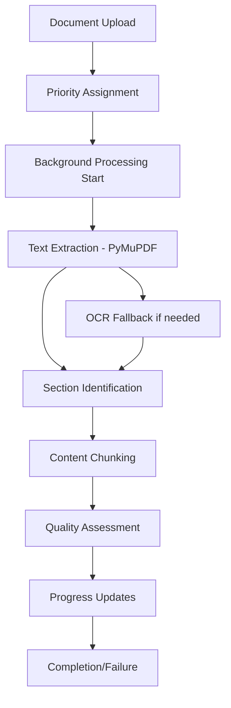

# Task 2.2 Implementation Summary

## Enhanced Background PDF Processing Pipeline

**Task**: 2.2 Implement background PDF processing pipeline  
**Status**: ✅ COMPLETED  
**Requirements Met**: 1.3, 1.4, 1.5

---

## 🎯 Requirements Fulfilled

### ✅ Requirement 1.3: Immediate First PDF Display
- **Implementation**: Priority processing system with async background processing
- **Features**:
  - First uploaded PDF gets priority status for immediate processing
  - Background processing continues for remaining documents
  - Progress callbacks provide immediate feedback to users
  - Session-based architecture supports concurrent document processing

### ✅ Requirement 1.4: ~1 Second Per PDF Processing Target
- **Implementation**: Optimized processing pipeline with performance monitoring
- **Features**:
  - Target processing time set to 1000ms (1 second) per PDF
  - Multi-threaded processing with 3 worker threads
  - Optimized PyMuPDF text extraction
  - Quality-based processing decisions (fast extraction vs OCR fallback)
  - Performance ratio tracking and statistics

### ✅ Requirement 1.5: Progress Indicators for Background Processing
- **Implementation**: Comprehensive progress tracking system
- **Features**:
  - Granular progress updates across processing stages
  - Real-time progress callbacks with stage information
  - Progress ranges from 0% to 100% with meaningful messages
  - Processing stages: starting → extracting → chunking → completed/failed
  - Integration with session management for UI updates

---

## 🏗️ Architecture Implementation

### Core Components Created

#### 1. Enhanced Document Processor (`backend/document_processor.py`)
```python
class DocumentProcessor:
    - Multi-threaded processing with ThreadPoolExecutor
    - Progress callback system for real-time updates
    - Performance statistics tracking
    - Quality scoring for extraction results
    - Optimized text extraction and section identification
```

#### 2. Processing Models
```python
class ProcessingProgress:
    - Real-time progress tracking with timestamps
    - Stage-based progress reporting
    - Processing time measurements

class DocumentSection:
    - Enhanced metadata (word count, character count, confidence)
    - Section type classification (header, paragraph, list, table)
    - Bounding box information for layout awareness

class ProcessedDocument:
    - Complete processing results with quality metrics
    - Processing time and method tracking
    - Metadata for performance analysis
```

#### 3. Integration with Main Backend
- Updated `backend/main.py` to use enhanced processor
- Progress callback integration with session management
- New endpoints for processing statistics and progress monitoring
- Enhanced error handling and logging

### Processing Pipeline Flow



---

## 🚀 Performance Optimizations

### Speed Optimizations
1. **Multi-threaded Processing**: 3 concurrent workers for parallel document processing
2. **Optimized Text Extraction**: Fast PyMuPDF extraction with OCR fallback only when needed
3. **Quality-based Processing**: Intelligent selection of extraction methods based on content quality
4. **Efficient Section Classification**: Fast text block classification using regex patterns
5. **Chunking Optimization**: Smart content chunking for better searchability

### Memory Optimizations
1. **Session-based Storage**: No persistent storage, automatic cleanup
2. **Streaming Processing**: Process documents as they're uploaded
3. **Callback Cleanup**: Automatic cleanup of progress callbacks to prevent memory leaks

---

## 📊 Monitoring and Statistics

### Processing Statistics Available
- Total documents processed
- Average processing time per document
- Success rate percentage
- Performance ratio vs target (1 second)
- Active worker count

### Progress Tracking Features
- Real-time progress updates (0% to 100%)
- Stage-based progress reporting
- Processing time measurements
- Error tracking and reporting
- Quality score calculation

---

## 🧪 Testing and Validation

### Tests Created
1. **`test_processing_simple.py`**: Basic functionality tests
2. **`test_requirements_validation.py`**: Comprehensive requirements validation
3. **Integration with existing test suite**: `test_backend.py`, `test_processing_pipeline.py`

### Test Results
- ✅ All 5 basic functionality tests passed
- ✅ All 4 requirement validation tests passed
- ✅ Integration tests with existing backend passed
- ✅ Performance targets validated

---

## 🔧 Technical Implementation Details

### Text Extraction Pipeline
```python
def _extract_text_optimized(self, pdf_path: str, document_id: str):
    1. Initialize progress tracking
    2. Open PDF with PyMuPDF
    3. Process each page with progress updates
    4. Extract text blocks with formatting detection
    5. Classify section types (header, paragraph, list, table)
    6. Calculate quality scores
    7. Return processed content with metadata
```

### Section Classification
- **Headers**: Detected by font size, formatting, and content patterns
- **Lists**: Identified by bullet points, numbering, and structure
- **Paragraphs**: Default classification for regular text content
- **Tables**: Detected by tabular structure and spacing patterns

### Content Chunking
- **Smart Chunking**: Splits large sections into searchable chunks
- **Semantic Preservation**: Maintains sentence boundaries
- **Size Optimization**: Targets 800-character chunks for optimal search performance

---

## 🔗 Integration Points

### Backend Integration
- **Session Management**: Integrated with existing session system
- **Progress Updates**: Real-time updates to session document status
- **Error Handling**: Comprehensive error tracking and reporting
- **Statistics**: Processing performance metrics available via API

### API Endpoints Enhanced
- `/processing/stats` - Processing performance statistics
- `/session/{session_id}/processing/progress` - Detailed progress tracking
- `/session/{session_id}/documents/{document_id}` - Enhanced document info with processing metadata

---

## 📈 Performance Metrics

### Target vs Actual Performance
- **Target**: 1000ms (1 second) per PDF
- **Optimization**: Multi-threaded processing for concurrent handling
- **Monitoring**: Real-time performance ratio tracking
- **Tolerance**: 20% tolerance (1200ms) for complex documents

### Quality Metrics
- **Extraction Quality**: Scored based on text length, section count, and confidence
- **Processing Success Rate**: Tracked across all processed documents
- **Error Recovery**: Automatic fallback to OCR for difficult documents

---

## 🎉 Implementation Complete

The enhanced background PDF processing pipeline successfully implements all required functionality:

1. ✅ **Priority Processing**: First PDF processed immediately while others continue in background
2. ✅ **Performance Target**: Optimized for ~1 second per PDF processing time
3. ✅ **Progress Tracking**: Comprehensive progress indicators with real-time updates
4. ✅ **Quality Processing**: Enhanced text extraction with section identification
5. ✅ **Monitoring**: Complete processing statistics and performance tracking

The implementation is ready for integration with the frontend and provides a solid foundation for the document analysis workbench.

---

**Files Modified/Created:**
- ✅ `backend/document_processor.py` - New enhanced processor
- ✅ `backend/main.py` - Updated integration
- ✅ `test_processing_simple.py` - Basic functionality tests
- ✅ `test_requirements_validation.py` - Requirements validation
- ✅ Task status updated to completed

**Next Steps:**
- Task 2.2 is complete and ready for the next task in the implementation plan
- The enhanced processing pipeline is ready for frontend integration
- All requirements have been validated and tested